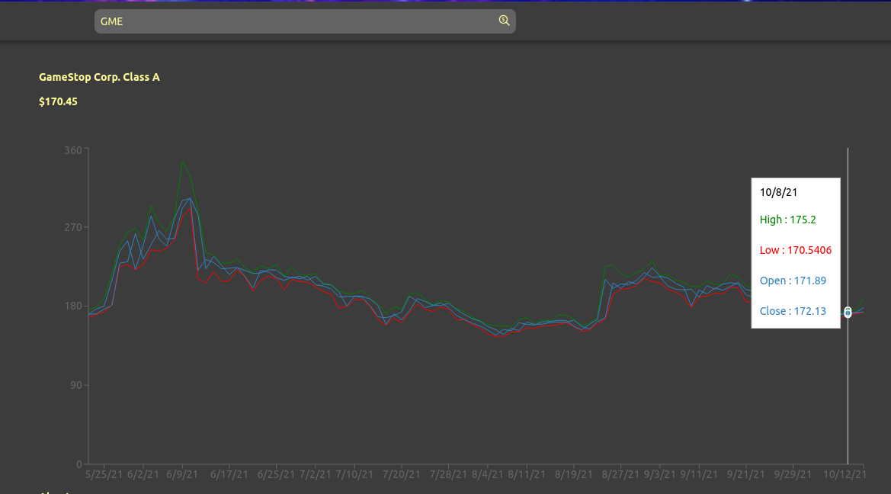

# MerryMen

1. <a href="#what-is-merrymen">About</a>
1. <a href="#features">Features</a>
1. <a href="#technologies">Technologies</a>
1. <a href="#setup">Setup</a>

## What is MerryMen?
MerryMen is a clone of Robinhood. The main goal for MerryMen is to begin studies in the field of financial technologies. Robinhood was used to inspire initial basic design and functionality, with an end goal to develop basic algorithmic trading software.

Business data compiled from Polygon's API, combined with live price data from Alpaca's API gives users access to large amounts of information to inform trading decisions.

Check out the live demo <a href="https://merrymenstocks.herokuapp.com/">here</a>!

<a href="https://github.com/bryanlancy/MerryMen/wiki">Explore the docs »</a>

## Features
### Search for stock prices
Search for stocks by ticker symbol and get live price data, powered by [**Alpaca's API**](https://alpaca.markets/). Interactive charts simplify viewing historic price data.

### Create watchlists
Save stocks that you want to monitor to watchlists, making them easily accessible for future analysis.

### Large amounts of business data
Using [**Polygon's API**](https://polygon.io/), thousands of the most common businesses' information have been collected to provide further insight on potential trading decisions.

## Technologies

Frontend

    
    
    

    
    

Backend

    
    
    

APIs

    
    

## Setup

 <em>
    The following setup assumes that you have PostgreSQL installed and have permissions to add a new user. Documentation can be found <a href="https://www.postgresql.org/">here</a>.
</em>
 
<em>
    You will also need access to Alpaca's API. Specifically, you will need a client id and secret key as this application uses a client credentials flow for authorization with Alpaca's API. Sign up or sign in to the Alpaca dashboard <a href="https://alpaca.markets/docs/">here</a>.
</em>

  

1. **Clone repository & install Node dependencies**
    1. Clone the project with: 
    `git clone https://github.com/bryanlancy/Clonify.git`

    1. In the root project directory run the command: 
    `npm run install`
1. **Setup the backend environment**
    1. Make a copy of the `.env.example` file found in the `backend` folder and rename it to `.env`.
    1. In the `.env` file, replace all values surrounded in `< >` with the corresponding information. Unless you have already done so, you can generate these values now.

        - `DB_USERNAME` - PostgreSQL user name
        - `DB_PASSWORD` - PostgreSQL user password
        - `DB_DATABASE` - PostgreSQL database name
            - database will be created in a later step.
        - `JWT_SECRET` - JSON Web Token Secret
            - should be unique and secure.
        - `APCA_API_KEY_ID` - Alpaca Client ID
        - `APCA_API_SECRET_KEY` - Alpaca Client Secret

         

        :warning: *The `.env.example` is tracked by git version control, **do not** save any sensitive information in this file.*
    1. **Create PostgreSQL user.**
        - In your terminal run, `psql`, to start PostgreSQL's interactive terminal.
        - `CREATE USER <DB_USERNAME> WITH PASSWORD '<DB_PASSWORD>' CREATEDB;`. Remember to replace the values in `< >` with the values we created in the previous step.
        
1. **Create & seed the database**
    1. In your terminal, navigate to the `backend` folder found in the main project directory.
    1. Then run, `npm run db-setup`. This will run a series of commands that should automatically set up your database. If any errors occur, you can run the commands individually, in this order.
        1. `npm run db-create`
        1. `npm run db-migrate`
        1. `npm run db-seed`
1. **Start the application**
    1. In your terminal, navigate to the main project folder.
    1. Then run `npm start`. This will start the backend and frontend server.  
        - Each server can be started manually by navigating to the respective folder, `frontend` and `backend`, and running the command `npm start`.
    1. In your browser navigate to <a href="http://localhost:3000">localhost:3000</a>
